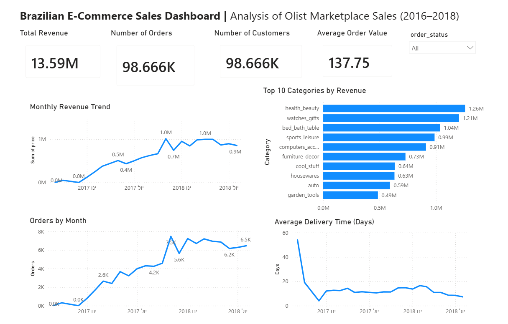
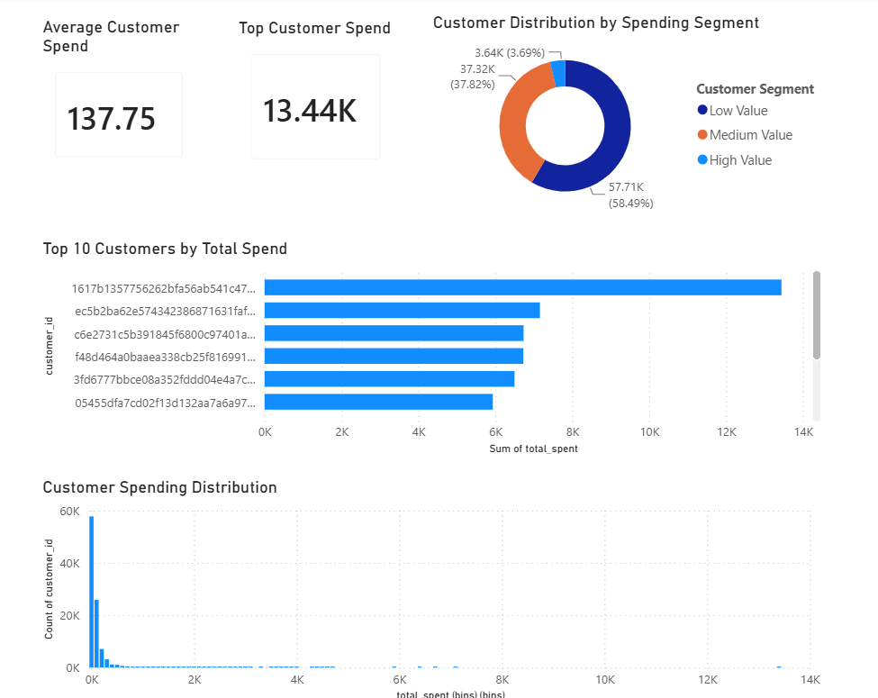

# Olist E-Commerce Sales Analysis

## Project Overview

This project analyzes sales performance and customer behavior using the Olist Brazilian E-Commerce dataset.

The analysis combines Python-based Exploratory Data Analysis (EDA) with interactive Power BI dashboards to identify revenue trends, customer purchasing patterns, and actionable business insights.

---

## Business Objectives

- Analyze revenue and order trends over time.
- Identify the product categories driving business performance.
- Understand customer purchasing and spending patterns.
- Generate actionable business insights to support strategic decision-making.

---

## Tools Used

- Python
- Pandas
- NumPy
- Matplotlib
- Seaborn
- Google Colab
- Power BI

---

## Project Workflow

### 1. Data Cleaning & Preparation

- Cleaned and validated the raw data.
- Handled missing values.
- Converted data types.
- Created derived features for analysis.
- Prepared datasets for dashboard reporting.

### 2. Exploratory Data Analysis (EDA)

The notebook investigates several business questions, including:

- Revenue trends over time.
- Order volume trends.
- Average Order Value (AOV).
- Product category performance.
- Customer purchasing behavior.
- Revenue concentration (Pareto analysis).

### 3. Dashboard Development

Two interactive Power BI dashboards were created.

#### Sales Performance Dashboard

Tracks:

- Total Revenue
- Number of Orders
- Unique Customers
- Average Order Value (AOV)
- Monthly Revenue Trend
- Average Delivery Time
- Top Product Categories

#### Customer Analysis Dashboard

Tracks:

- Revenue per Customer
- Customer Value Distribution
- Customer Segmentation
- Top Spending Customers
- Revenue Concentration (Pareto)

---

## Key Insights

### Sales Performance

- Revenue and order volume increased significantly throughout the analyzed period.
- Revenue growth was primarily driven by increasing order volume rather than higher order values.
- Revenue was concentrated within a limited number of product categories.
- A partial final month was identified and excluded from trend analysis.

### Customer Analysis

- Customer spending is highly skewed.
- Most customers belong to the Low Value segment.
- A small group of high-value customers contributes disproportionately to total revenue.
- Significant variation exists between average and top customer revenue.

---

## Dashboard Preview

### Sales Performance Dashboard



### Customer Analysis Dashboard



---

## Repository Structure

```text
├── Olist_EDA.ipynb
├── Olist_Dashboard.pbix
├── README.md
├── requirements.txt
└── images/
    ├── sales_dashboard.png
    └── customer_dashboard.png
```

---

## How to Run

1. Clone or download this repository.
2. Install the required Python packages:

```bash
pip install -r requirements.txt
```

3. Open the notebook in Jupyter Notebook or Google Colab.
4. Run all notebook cells.
5. Open the Power BI dashboard (`.pbix`) to explore the interactive visualizations.

---

## Future Improvements

Potential extensions for this project include:

- Customer retention and cohort analysis.
- RFM customer segmentation.
- Geographic sales analysis.
- Predictive sales forecasting.
